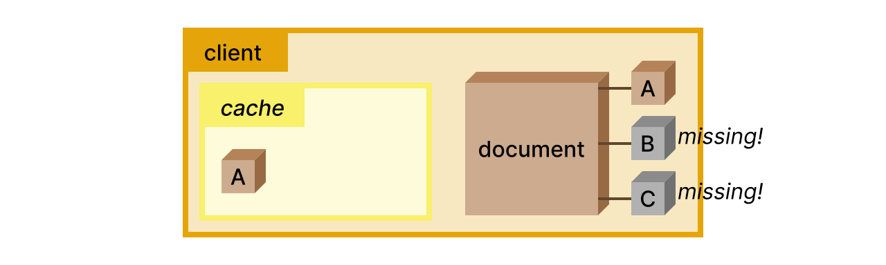
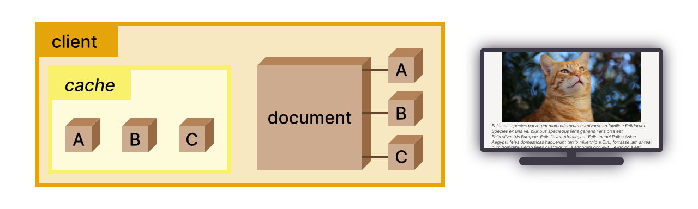

# Overview: bundle preloading

The basic operation of resource preloading with bundled responses follows this outline:

1. the Web document provides (declaratively or imperatively) a list of required resources;
1. the client sends an HTTP request for those not in its cache;
1. the server replies with a bundled response containing the requested resources.

The API to implement bundle preloading consists of:

* a declarative way in HTML to list resources to be retrieved in a bundle;
* an imperative JavaScript API for bundle preloading;
* request headers and corresponding response behavior for delivering bundled resources.

This page explains the general mechanism of bundle preloading and shows examples of each of these features in use, walking through their basic interaction with websites and caches. More complex situations and details, such as CDN behavior and different server edge cases, are discussed in subsequent parts of this proposal.


## Mechanism

Let's start with a simplified description of the general mechanism used in this proposal:

When the user wants to visit a Web page, their *client* requests and receives a *document* from a remote *server*.


Since the Web page requires more styles, images, code, etc. to be properly displayed, the *document* provides a list of required resources that may be preloaded in a bundle (`A`, `B`, `C`).

The *client* examines its own cache and discovers that it already has one of those resources (`A`), but not the others (`B`, `C`).



The *client* sends a request to the *server* to retrieve a bundle with the resources (`B`, `C`) required by the *document* and which could not be found in the cache.

The *server* replies with a bundle containing the requested resources.


Finally, the *client* has everything that it needs to display the Web page!




## HTML script tag

Web developers can preload resources from a bundle by using a `<script>` tag with `type=bundlepreload`. The tag contains a static resource list in JSON format declaring the responses expected to be included in the bundle. Only resources declared in a resource list may be accessed from the bundle; this ensures [URL integrity](./glossary.md#rsrc-integrity) is preserved.

Consider the following resource list for the page `https://www.example.com/index.html`:

```html
<script type=bundlepreload>
{
    "source": "./assets/resources.wbn",
    "resources": [
        "render.js",
        "sidebar.js",
        "profile.png"
    ]
}
</script>
```

Because of same origin and path restrictions, the resources referenced by the bundle *must* correspond to URLs with the same base path component, where "base path component" refers to the URL truncated before the last path component (`https://www.example.com/assets/` in our example).

For easier portability, the list may use relative locations as in the example.

This directs the browser that it _may_ serve any of the resources in the `"resources"` list by making a single request for `https://www.example.com/assets/resources.wbn`. That request *must* contain the [structured header](https://www.fastly.com/blog/improve-http-structured-headers) `Bundle-Preload`; the value for the `Bundle-Preload` header may only contain a non-empty subset of the `"resources"` list. To retrieve all the declared resources, the request may look like:

```
GET /assets/resources.wbn HTTP/1.1
...
Host: www.example.com
Bundle-Preload: "render.js", "sidebar.js", "profile.png"
...
```

The response to that request _must_ be a bundled response containing HTTP responses for each of the following URLs:

```
https://www.example.com/assets/render.js
https://www.example.com/assets/sidebar.js
https://www.example.com/assets/profile.png
```

For more details on the bundled response format, see the [IETF WEBPACK draft](https://github.com/wpack-wg/bundled-responses).

Any references to these resources later in the document _may_ be loaded from the bundled response. For example, if the following elements are present later on the page, the comments indicate what the browser may do:

```html

<!-- the image may be loaded from the bundle without an additional request -->


<!-- if this relative location corresponds to one of the URLs in the bundle, 
     the image may be loaded from the bundle without an additional request -->


<!-- this URL was not part of the bundle (note the different path), so this
     results in a new request to https://example.com/more_assets/profile.png -->
```


## JavaScript API

Suppose the page at `https://www.example.com/index.html` instead contained the following JavaScript:

```html
<script>
window.bundlePreload({
    source: "./assets/resources.wbn",
    resources: ["render.js", "sidebar.js", "profile.png"]
});
// Results in bundle preloading request, as in previous section

let img1 = document.createElement("img");
img1.src = "profile.png";
// A new request to https://www.example.com/profile.png

let img2 = document.createElement("img");
img2.src = "assets/profile.png";
// Response may be loaded from bundle without an additional request

let img2 = document.createElement("img");
img2.src = "https://www.example.com/assets/profile.png";
// Response may be loaded from bundle without an additional request
</script>
```

The behavior here matches the behavior for the static resource list.

## Bundle preloading requests and responses

The example request used in the previous section contained a new structured `Bundle-Preload` header. This section showcases the behavior of that header and the expected responses.

In this section, we are assuming both the server and the browser have implemented support for bundle preloading. We call this the full implementation use case. The other documents in this proposal cover how bundle preloading works when one of the parties doesn't implement bundle preloading. The goal in those situations is to achieve [graceful degradation](./glossary.md#degradation) for parties that don't implement bundle preloading, while allowing [progressive enhancement](./glossary.md#enhancement) for all parties that do implement bundle preloading.

In the full implementation use case, the browser may make a request like this:

```
GET /assets/resources.wbn HTTP/1.1
...
Host: www.example.com
Bundle-Preload: "render.js", "sidebar.js", "profile.png"
...
```

The `Bundle-Preload` header may not always contain all of the values listed in either the `<script type=bundlepreload>` section or the `window.bundlePreload(...)` call. For example, if the browser has a cached response for `https://www.example.com/assets/profile.png`, the header might instead have the following value:

```
Bundle-Preload: "render.js", "sidebar.js"
```

The server response to any bundle preloading request _must_ be a [bundled response](https://datatracker.ietf.org/doc/draft-ietf-wpack-bundled-responses/) file. Additionally, it _must_ include the `Vary: Bundle-Preload` directive. For example, for the request for three resources used in these examples, some of the response headers would have these values:

```
Content-Type: application/webbundle
Vary: Bundle-Preload
...
*** data for the resources "render.js", "sidebar.js", and "profile.png" ***
```

The `Bundle-Preload` header isn't the only HTTP change introduced by this proposal, but it is the most important one. For a more detailed description of how bundle preloading works with other HTTP headers such as `Vary` and `Cache-Control`, see the section on [bundle preloading for servers](./subresource_loading_server.md).

## Putting it all together

Let's consider how bundle preloading usage might look for a large Web application. We'll demonstrate how:
* Bundle preloading enables effective [code splitting](./glossary.md#codesplitting)
* Bundlers can use bundle preloading to prioritize [responsiveness](./glossary.md#tti)
* Updates to individual resources do not cause [cachebusting](./glossary.md#cachebusting)

Let's consider a Web application with the following layout:

```
├── assets
│   ├── css
│   │   ├── base.css
│   │   ├── index.css
│   │   ├── profile.css
│   │   └── sidebar.css
│   ├── img
│   │   └── logo.png
│   ├── js
│   │   ├── analytics.js
│   │   ├── fancyWidget.js
│   │   └── sidebar.js
│   └── site.wbn
├── index.html
└── profile.html
```

`site.wbn` is a bundle containing all of the other files under `assets/`.

Note that from the point of view of this protocol, it is not strictly necessary that the content of the bundle is duplicated in the server's filesystem. In theory, it would be possible for the server to store just the bundle file and use it to serve single (not bundled) requests to individual resources. Detailed prototyping will be necessary to evaluate the performance implications of that alternative approach.

### Code splitting

In this example, the server side task of code splitting is simple. `site.wbn` contains all the `css`, `img`, and `js` files.

An example resource list for the `index.html` page might look like this:

```html
<script type=bundlepreload>
{
    "source": "./assets/site.wbn",
    "resources": [
        "css/base.css",
        "css/index.css",
        "img/logo.png",
        "js/analytics.js"
    ]
}
</script>
```

And a corresponding example resource list for the `profile.html` page could look like:

```html
<script type=bundlepreload>
{
    "source": "./assets/site.wbn",
    "resources": [
        "css/base.css",
        "css/profile.css",
        "img/logo.png",
        "js/analytics.js",
        "js/fancyWidget.js"
    ]
}
</script>
```

These resource lists contain overlapping resources. What would happen if a user were to visit `index.html` and then `profile.html` without any of the site cached?

On the initial visit to `index.html`, the browser could issue the following request:

```
GET /assets/site.wbn HTTP/1.1
...
Bundle-Preload: "css/base.css", "css/index.css", "img/logo.png", "js/analytics.js"
...
```

Let's assume that the responses for each of those resources in the bundle has the response header `Cache-Control: immutable` , directing to the browser that it may keep those resources cached.

When the user then navigates to `profile.html`, the browser can then issue the following request:

```
GET /assets/site.wbn HTTP/1.1
...
Bundle-Preload: "css/profile.css", "js/fancyWidget.js"
...
```

Because the browser _may_ issue requests for a subset of the listed resources, it may instead choose to serve resources it already has from its cache. This helps achieve effective code splitting.

### Responsiveness

An important metric for many websites with lots of static resources to load is the [TTI](./glossary.md#tti), or the time until the page is ready for user interaction. Before that time, the user is waiting for the browser to load and process the resources needed to render the page.

In this example, we've omitted `css/sidebar.css` and `js/sidebar.js` from the static resource lists embedded in the page with `<script type=bundlepreload>` tags. A bundler or Web developer might defer loading of these resources until the page has rendered and is ready for user interaction, in order to improve TTI. A simple way to then preload these resources so that the sidebar will respond quickly without delays caused by needing to fetch resources would be:

```js
document.body.onload = function() {
    window.bundlePreload({
        source: "./assets/site.wbn",
        resources: ["css/sidebar.css", "js/sidebar.js"]
    });
};
```

This makes it easy to dynamically load parts of bundles together, whenever client code determines it is ready to preload them.

### Cachebusting

Many people using the Web have metered internet data, lower bandwidth connections, and infrequent internet access. For such users it can be especially important to avoid causing them to unnecessarily download extra data to access a site. Even as websites change, some avoid changing their bundling configurations ("cachebusting") so that users can use already cached resources for a website; this spares users from needing to download a whole bundle when only some of the resources it contains have changed. It does so at the expense of needing to track historical bundling configurations on the server side, to model and estimate user cache contents, and to balance complicated performance heuristics.

Bundle preloading helps sites to avoid cachebusting. Let's consider what happens to a user who has already visited our entire example site. Because the responses contained in the bundle all have the `Cache-Control: Immutable` response header, their browser has likely retained these resources in its cache. But what if a Web developer wants to change the base stylesheet and logo for a site, as well as improve the fanciness of `fancyWidget.js`?

All the developer needs to do is [rev](./glossary.md#revving) those resources' URLs and update the resource list. For example, in `index.html`:

```html
<script type=bundlepreload>
{
    "source": "./assets/site.wbn",
    "resources": [
        "css/base2.css",
        "css/index.css",
        "img/hot-new-logo-2021-rev2.png",
        "js/analytics.js"
    ]
}
</script>
```

And in `profile.html`:

```html
<script type=bundlepreload>
{
    "source": "./assets/site.wbn",
    "resources": [
        "css/base2.css",
        "css/profile.css",
        "img/hot-new-logo-2021-rev2.png",
        "js/analytics.js",
        "js/fancierWidget.js"
    ]
}
</script>
```

Again, because the browser has cached resources, the bundle preloading requests might only contain resources the browser does not have. If the user visits `profile.html` first after the page has changed, their browser could issue just the following request:

```
GET /assets/site.wbn HTTP/1.1
...
Bundle-Preload: "css/base2.css", "img/hot-new-logo-2021-rev2.png", "js/fancierWidget.js"
...
```

Of course, this Web developer's strategy for revving isn't ideal; it would help them to use a bundler that can perform revving for them, perhaps producing [merkled](https://en.wikipedia.org/wiki/Merkle_tree) URLs inside Web bundles rather than manually renaming files. One suspects that `js/fanciestWidget.js` is just around the corner, but solving that problem is another topic well beyond the scope of this proposal.

<!--
## "But what about..."

Wait! We know, there are some complicated edge cases. We've probably missed a few of them, and would like to hear from you about where we could improve. But this page doesn't point a complete picture. So first, if you want to know more about:

- Backwards compatibility, graceful degradation, and progressive enhancement: See 🚧[this section](#)🚧.
- Preserving resource integrity, not breaking content blockers: Check out 🚧[this part](#)🚧.
- Other alternatives we considered: We've 🚧[got that covered](#)🚧 too.
- Fetch destination and request priority: Have you explored the 🚧[browser semantics](#)🚧?

🚧 Note, 2021-05-13: Okay, we haven't answered your questions yet. This is our list of what's coming next! We appreciate any input you have in the meantime, too. 🚧

We explain many of the design decisions and tradeoffs in the other pages of this proposal. There's also a page for [frequently asked questions](./faq.md). We've made a lot of changes to this proposal, so some of those sections may be marked as out-of-date with 🚧 warnings 🚧; stay tuned for more updates to those sections soon. For any other questions, the [README](./README.md) covers where discussion happens - in the issues on this repository and our open Matrix channel.
-->

## Summary

This is an overview of bundle preloading. In summary:

* Bundle preloading introduces a mechanism for browsers to preload and natively interpret multiple resources with a single request.
* Browsers only serve bundled responses from the same scope as the bundle, helping to preserve resource identity.
* If browsers have cached responses, they can request only a subset of what a bundle may contain.
* Servers do not need to keep track of any per-client bundle or cache state.
* This mechanism simplifies code splitting for bundlers, allowing client side JavaScript to decide what and when it needs resources.

[Previous section](./motivation.md) - [Table of contents](./README.md#table-of-contents) - [Next section](./subresource-loading-client.md)
